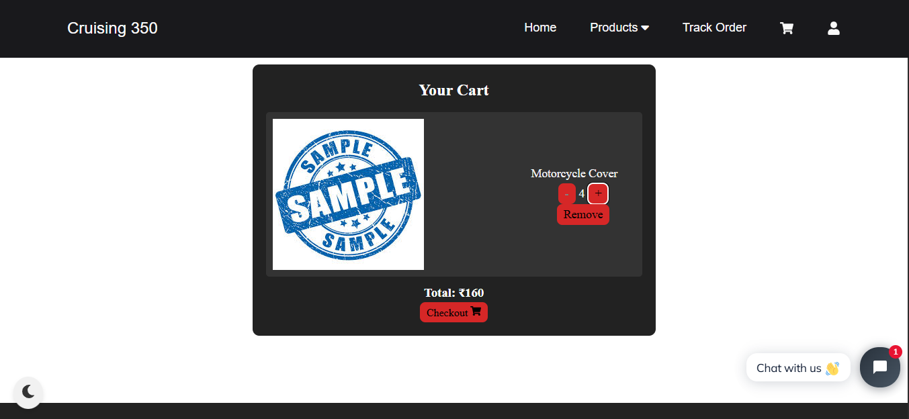
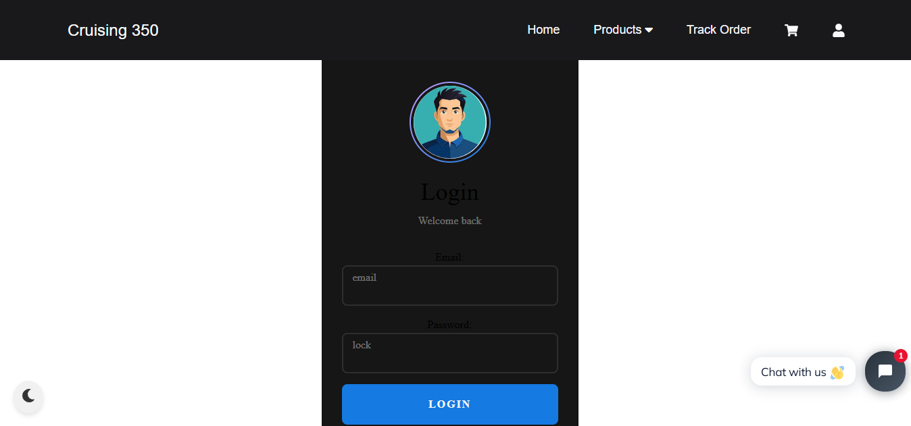

# 🛵 Cruising350

**Cruising350** is a sleek, responsive product website inspired by the legendary Royal Enfield Classic 350. Built with **React**, it showcases bike gear, supports user authentication, cart functionality, theme switching, and includes a live AI chatbot — all in a lightweight, interactive experience.

🔗 **Live Demo:** [https://cruising350.netlify.app](https://cruising350.netlify.app)

---

## 🚀 Features

- 🛍️ **Products Page** – Showcase of bike gear & accessories
- 🛒 **Cart System** – Add/remove items using localStorage (persistent storage)
- 🔐 **Firebase Authentication** – Secure login/signup with Firebase
- 🎨 **Dark/Light Mode Toggle** – Context API-based theming
- 🤖 **AI Live Chatbot** – Chat with a virtual assistant in real-time
- ⚡ **Fast & Lightweight UI** – Built purely in React and CSS
- 📱 **Fully Responsive** – Works great on all screen sizes

---

## 🛠️ Tech Stack

- **React.js**
- **Firebase (Auth)**
- **Context API**
- **CSS3**
- **LocalStorage API**
- **Netlify** (for deployment)

---

## 📸 Screenshots

### 🏍️ Products Page

### 🛒 Cart System

### 🔐 Auth Page

---

## 📁 Folder Structure

Cruising350/ ├── public/ │ └── screenshots/ │ ├── products.png │ ├── cart.png │ └── auth.png ├── src/ │ ├── components/ │ ├── pages/ │ ├── context/ │ └── firebase/ ├── README.md ├── package.json └── ...

---

## 👨‍💻 Developer

**Vinayak Singh**  
React enthusiast | DOM Specialist | Full-Stack Web Developer  
📧 vinayaksinghforyou@gmail.com  
🔗 [LinkedIn](https://www.linkedin.com/in/vinayak-singh-8ab2442ab)

---

> 🛣️ Riding code like I ride roads — smooth, dynamic, and with style.  
> 🚧 Open to collaborations, feedback, and contributions!
